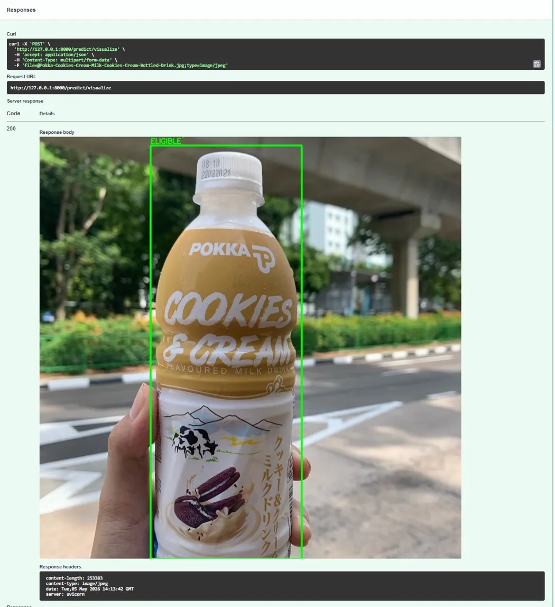
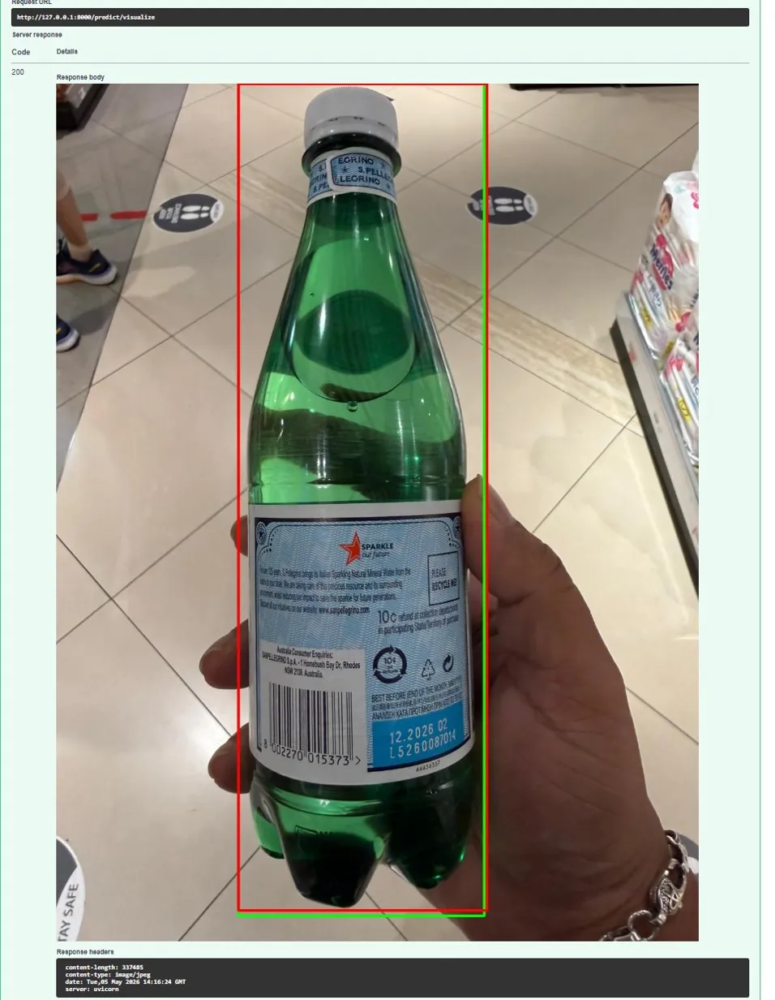

# BCRS Vision Pipeline 🥤

A computer vision system that detects and classifies beverage containers using YOLOv8, simulating Singapore's [Beverage Container Return Scheme (BCRS)](https://www.nea.gov.sg/our-services/waste-management/beverage-container-return-scheme). Deployed on AWS with a full CI/CD pipeline.

## Demo

**Eligible container (Plastic Bottle) — GREEN box:**



**Mixed detection (Plastic + Glass) — GREEN = Eligible, RED = Not Eligible:**



## Architecture

Image Upload (POST /predict)
↓
FastAPI Server
↓
YOLOv8 Inference
↓
BCRS Eligibility Check
↓
JSON Response

**Infrastructure:**

GitHub Push
↓ (triggers)
GitHub Actions CI/CD
↓ (build & push)
AWS ECR (Docker Registry)
↓ (pull & run)
AWS ECS Fargate (Live API)

## Tech Stack

| Layer | Technology |
|---|---|
| Model | YOLOv8s (Ultralytics) |
| API | FastAPI + Uvicorn |
| Container | Docker |
| Image Registry | AWS ECR |
| Deployment | AWS ECS Fargate |
| CI/CD | GitHub Actions |
| Language | Python 3.11 |

## API Endpoints

| Method | Endpoint | Description |
|---|---|---|
| GET | `/health` | Health check |
| POST | `/predict` | Returns JSON with detections and BCRS eligibility |
| POST | `/predict/visualize` | Returns annotated image with bounding boxes |

## Model Performance

Trained on [Beverage Containers Dataset](https://universe.roboflow.com/roboflow-universe-projects/beverage-containers-3atxb) from Roboflow Universe.

| Metric | Score |
|---|---|
| mAP50 | 96.8% |
| mAP50-95 | 88.7% |
| Training epochs | 50 |
| Base model | YOLOv8s |

### Per-class Results

| Class | mAP50 |
|---|---|
| tin can | 98.3% |
| cup-handle | 98.9% |
| bottle-glass | 97.0% |
| gym bottle | 97.5% |
| glass-mug | 97.7% |
| bottle-plastic | 96.4% |
| glass-wine | 96.7% |
| glass-normal | 94.4% |
| cup-disposable | 93.9% |

## BCRS Eligibility Logic

Based on Singapore's actual BCRS scheme:

| Class | Eligible |
|---|---|
| bottle-plastic | ✅ Yes (10 cents) |
| tin can | ✅ Yes (10 cents) |
| bottle-glass | ❌ No |
| gym bottle | ❌ No |
| cup-disposable | ❌ No |
| glass-* | ❌ No |

## Project Structure

BCRS-Vision-Pipeline/
├── app/
│   ├── main.py          # FastAPI application
│   ├── model.py         # YOLOv8 inference + visualization
│   └── schemas.py       # Pydantic response models
├── model/
│   └── best.pt          # Trained YOLOv8 weights
├── docs/
│   ├── demo_pokka.jpg
│   └── demo_pellegrino.jpg
├── .github/
│   └── workflows/
│       └── deploy.yml   # GitHub Actions CI/CD
├── Dockerfile
├── requirements-docker.txt
└── requirements.txt

## Running Locally

```bash
# Clone the repo
git clone https://github.com/popolome/BCRS-Vision-Pipeline.git
cd BCRS-Vision-Pipeline

# Create virtual environment
python -m venv venv
venv\Scripts\activate

# Install dependencies
pip install -r requirements.txt

# Run the API
uvicorn app.main:app --reload
```

Visit `http://127.0.0.1:8000/docs` for the interactive API documentation.

## Author

**Mak Jun Kit**
- GitHub: [@popolome](https://github.com/popolome)
- LinkedIn: [Jun Kit Mak](https://www.linkedin.com/in/jun-kit-mak-611b4b108/)